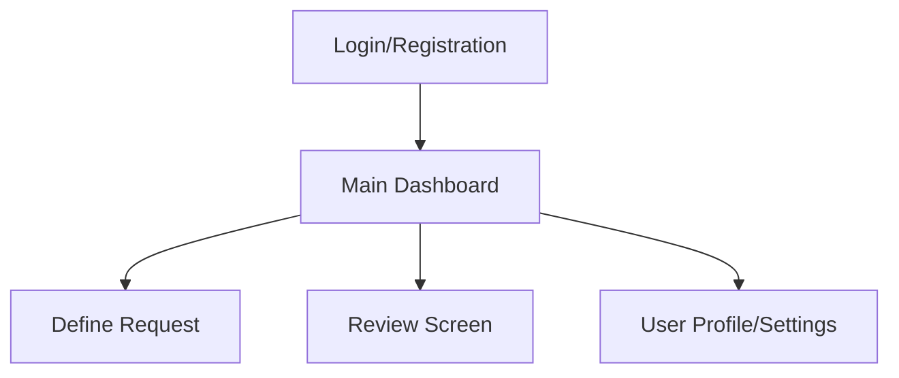

# AI Question Collector UI/UX Specification

## 1. Introduction

This document defines the user experience goals, information architecture, user flows, and visual design specifications for the AI Question Collector's user interface. It serves as the foundation for visual design and frontend development, ensuring a cohesive and user-centered experience.

### 1.1. Overall UX Goals & Principles

#### 1.1.1. Target User Personas

*   **Curriculum Developer/Educator:** These users are the primary audience. They are professionals who need to efficiently create, manage, and export high-quality educational question banks. They value accuracy, consistency, and time-saving features.

#### 1.1.2. Usability Goals

*   **Efficiency:** Users should be able to generate, review, and export question batches quickly, aiming for 50 questions in under 15 minutes.
*   **Accuracy:** The interface should facilitate the review process to ensure the accuracy and quality of AI-generated questions.
*   **Reliability:** The system should consistently perform as expected, providing a stable and trustworthy experience.
*   **Ease of Use:** The workflow should be intuitive and straightforward, minimizing the learning curve for new users.

#### 1.1.3. Design Principles

1.  **Clarity over Cleverness:** Prioritize clear communication and straightforward interactions.
2.  **Efficiency through Workflow:** Design the UI to optimize the "Define, Generate, Review, Export" workflow, reducing unnecessary steps.
3.  **User Control & Feedback:** Provide users with clear control over the generation and review process, with immediate and understandable feedback.
4.  **Consistency:** Maintain consistent UI patterns, terminology, and visual elements throughout the application.
5.  **Accessibility by Default:** Design with accessibility in mind from the outset, ensuring the application is usable by a wide range of users.

### 1.2. Change Log

| Date       | Version | Description          | Author |
| :--------- | :------ | :------------------- | :----- |
| 2025-09-10 | 1.0     | Initial document draft | Sally  |

## 2. Information Architecture (IA)

### 2.1. Site Map / Screen Inventory



### 2.2. Navigation Structure

**Primary Navigation:** The main navigation will provide access to the core sections of the application: Dashboard, Define Request, Review Screen, and User Profile/Settings. This will likely be a persistent navigation element (e.g., a sidebar or top bar).

**Secondary Navigation:** Contextual navigation will appear within specific sections as needed. For example, the Review Screen might have secondary navigation for filtering or sorting questions.

**Breadcrumb Strategy:** A simple, hierarchical breadcrumb trail will be implemented to help users understand their current location within the application and easily navigate back to previous levels.

## 3. User Flows

### 3.1. Question Generation Workflow

**User Goal:** To successfully generate, review, and export a batch of educational questions.

**Entry Points:** Main Dashboard, direct access to the Define Request form after login.

**Success Criteria:** A batch of approved questions is successfully exported as a CSV file.

#### 3.1.1. Flow Diagram

```mermaid
graph TD
    A[User Logs In] --> B{Access Define Request Form}
    B --> C[Fill Parameters]
    C --> D[Submit Request]
    D --> E[AI Generates Questions]
    E --> F[Display Questions for Review]
    F --> G{Review Each Question}
    G -- Approve --> H[Save Approved Question to DB]
    G -- Reject --> I[Discard Question]
    H --> J{All Questions Reviewed?}
    I --> J
    J -- Yes --> K[Export Approved Questions to CSV]
    K --> L[Download CSV]
    L --> M[Workflow Complete]
    D -- Error --> N[Display Error Message]
    F -- No Questions Generated --> O[Display "No Questions" Message]
```

#### 3.1.2. Edge Cases & Error Handling:

*   Invalid input in Define Request form (handled by client-side validation and server-side validation).
*   AI fails to generate questions (display an informative "No Questions Generated" message).
*   LLM API errors (display a generic error message to the user, log detailed error for debugging).
*   Database errors during saving approved questions (display error, provide retry option).
*   Export failure (display error, provide retry option).

## 4. Wireframes & Mockups

### 4.1. Primary Design Files

**Primary Design Files:** Figma (Link to be provided once design files are created)

### 4.2. Key Screen Layouts

I can help conceptualize the layouts for the key screens identified in the PRD. These include:

*   **Login/Registration Screen:** Focus on clear input fields, secure password handling, and straightforward navigation.
*   **Define Request Screen (Wizard Interface):** Design a multi-step form that guides the user through parameter input with clear progress indicators.
*   **Review Screen:** Layout for displaying AI-generated questions, enabling easy review, editing, approval, and rejection. Consider a card or table-based view.
*   **Main Dashboard:** Overview of past and current question generation tasks, with clear status indicators and navigation to detailed views.

## 5. Component Library / Design System

### 5.1. Design System Approach

**Design System Approach:** For the MVP, we recommend leveraging an existing, well-established design system (e.g., Material Design, Ant Design, or Bootstrap with a custom theme). This approach accelerates development, ensures consistency, and benefits from pre-built accessibility features. A custom design system can be developed in later phases if unique branding or complex component needs arise.

### 5.2. Core Components

Here are some foundational components that will be essential for the AI Question Collector:

*   **Buttons:** Primary, secondary, tertiary, disabled, loading states.
*   **Input Fields:** Text, number, dropdowns, checkboxes, radio buttons, with various states (default, focused, error, disabled).
*   **Modals/Dialogs:** For confirmations, alerts, and complex interactions.
*   **Tables:** For displaying lists of questions in the Review Screen, with sorting, filtering, and pagination capabilities.
*   **Progress Indicators:** Spinners, progress bars for AI generation and loading states.
*   **Alerts/Toasts:** For system messages and user feedback.

## 6. Branding & Style Guide

### 6.1. Visual Identity

**Brand Guidelines:** To be determined. For the initial phase, we will establish a clean, professional, and minimalist visual identity that prioritizes usability and clarity.

### 6.2. Color Palette

| Color Type | Hex Code | Usage                               |
| :--------- | :------- | :---------------------------------- |
| Primary    | #007bff  | Main interactive elements, branding |
| Secondary  | #6c757d  | Secondary actions, subtle elements  |
| Accent     | #28a745  | Success indicators, positive actions|
| Success    | #28a745  | Positive feedback, confirmations    |
| Warning    | #ffc107  | Cautions, important notices         |
| Error      | #dc3545  | Errors, destructive actions         |
| Neutral    | #343a40   | Text, borders, backgrounds          |

### 6.3. Typography

#### 6.3.1. Font Families

*   **Primary:** 'Roboto', sans-serif (or similar clean sans-serif font)
*   **Secondary:** 'Open Sans', sans-serif (for body text, if different from primary)
*   **Monospace:** 'Fira Code', monospace (for code snippets, if any)

#### 6.3.2. Type Scale

| Element | Size | Weight | Line Height |
| :------ | :--- | :----- | :---------- |
| H1      | 2.5rem | 700    | 1.2         |
| H2      | 2rem   | 600    | 1.2         |
| H3      | 1.75rem| 500    | 1.3         |
| Body    | 1rem   | 400    | 1.5         |
| Small   | 0.875rem| 400    | 1.4         |

### 6.4. Iconography

**Icon Library:** Material Icons (or similar open-source icon set like Font Awesome)

**Usage Guidelines:** Icons should be used consistently to reinforce meaning and improve scannability. Maintain a consistent style (e.g., outlined, filled).

### 6.5. Spacing & Layout

**Grid System:** A flexible 12-column grid system (e.g., Bootstrap grid) for responsive layouts.

**Spacing Scale:** A consistent 8-point spacing scale for margins, padding, and component spacing (e.g., 8px, 16px, 24px, 32px).

## 7. Accessibility Requirements

### 7.1. Compliance Target

**Standard:** WCAG 2.1 AA

### 7.2. Key Requirements

**Visual:**
*   **Color contrast ratios:** Minimum 4.5:1 for text and images of text, and 3:1 for graphical objects and user interface components.
*   **Focus indicators:** Clear and visible focus indicators for all interactive elements (buttons, links, form fields) when navigated via keyboard.
*   **Text sizing:** Users must be able to resize text up to 200% without loss of content or functionality.

**Interaction:**
*   **Keyboard navigation:** All interactive elements must be operable via keyboard alone, with a logical tab order.
*   **Screen reader support:** All UI elements and content must be properly structured and labeled for screen reader interpretation (e.g., ARIA attributes, semantic HTML).
*   **Touch targets:** Sufficiently large touch targets (minimum 44x44 CSS pixels) for interactive elements on touch devices.

**Content:**
*   **Alternative text:** All non-text content (images, icons) that conveys meaning must have appropriate alternative text.
*   **Heading structure:** Use a logical and hierarchical heading structure (H1, H2, H3, etc.) to convey content organization.
*   **Form labels:** All form fields must have clearly associated and visible labels.

### 7.3. Testing Strategy

**Accessibility Testing:** A combination of automated accessibility testing tools (e.g., Lighthouse, Axe DevTools) during development, and manual testing with screen readers (e.g., NVDA, VoiceOver) and keyboard-only navigation. Regular audits will be conducted.

## 8. Responsiveness Strategy

### 8.1. Breakpoints

| Breakpoint | Min Width | Max Width | Target Devices                               |
| :--------- | :-------- | :-------- | :------------------------------------------- |
| Mobile     | 320px     | 767px     | Smartphones (portrait and landscape)         |
| Tablet     | 768px     | 1023px    | Tablets (portrait and landscape)             |
| Desktop    | 1024px    | 1439px    | Laptops, standard desktop monitors           |
| Wide       | 1440px    | -         | Large desktop monitors, ultrawide displays   |

### 8.2. Adaptation Patterns

**Layout Changes:**
*   **Mobile:** Single-column layouts, stacked elements, optimized for vertical scrolling.
*   **Tablet:** Two-column layouts where appropriate, larger touch targets, potentially more visible navigation.
*   **Desktop/Wide:** Multi-column layouts, more complex data tables, expanded navigation.

**Navigation Changes:**
*   **Mobile:** Collapsible menus (e.g., hamburger menu), bottom navigation bars for primary actions.
*   **Tablet/Desktop:** Persistent sidebars or top navigation bars.

**Content Priority:**
*   **Mobile:** Prioritize essential information and actions, deferring less critical content.
*   **Desktop:** More information can be displayed simultaneously, with richer data visualizations.

**Interaction Changes:**
*   **Mobile:** Emphasis on touch gestures, larger interactive elements.
*   **Desktop:** Hover states, keyboard shortcuts, more precise pointer interactions.

## 9. Animation & Micro-interactions

### 9.1. Motion Principles

*   **Purposeful:** Animations should serve a clear purpose, guiding the user's attention, providing feedback, or indicating state changes.
*   **Subtle & Fast:** Animations should be subtle, quick, and not impede the user's workflow. Avoid excessive or distracting motion.
*   **Consistent:** Apply motion consistently across similar interactions throughout the application.
*   **Performance-Minded:** Animations should be optimized for smooth performance across all target devices, avoiding jank or slowdowns.

### 9.2. Key Animations

*   **Button Click Feedback:** Subtle visual feedback (e.g., slight scale change, color shift) on button press to confirm interaction. (Duration: 100ms, Easing: ease-out)
*   **Form Validation Feedback:** Highlight invalid fields with a subtle shake or border color change, accompanied by clear error messages. (Duration: 200ms, Easing: ease-in-out)
*   **Loading Indicators:** Smooth, continuous animations for spinners or progress bars to indicate ongoing processes (e.g., AI generation, data loading). (Duration: Continuous, Easing: linear)
*   **Page Transitions:** Subtle fades or slides when navigating between major sections to provide a sense of continuity. (Duration: 300ms, Easing: ease-in-out)

## 10. Performance Considerations

### 10.1. Performance Goals

*   **Page Load:** Initial page load (First Contentful Paint) under 2.5 seconds on a typical 3G connection.
*   **Interaction Response:** User interface interactions (e.g., button clicks, form submissions) should respond within 100ms.
*   **Animation FPS:** Animations should maintain a consistent frame rate of 60 frames per second (FPS) for a smooth visual experience.

### 10.2. Design Strategies

*   **Image Optimization:** Use optimized image formats (e.g., WebP), compress images, and implement lazy loading for off-screen images.
*   **Minimalist Design:** Prioritize clean and uncluttered layouts to reduce the number of DOM elements and visual complexity.
*   **Efficient Animations:** Design animations to be performant, avoiding complex CSS properties that trigger layout recalculations.
*   **Progressive Loading:** Implement skeleton screens or loading indicators for content that takes time to load, providing immediate feedback to the user.
*   **Font Loading Optimization:** Optimize custom font loading to prevent Flash of Unstyled Text (FOUT) or Flash of Invisible Text (FOIT).

## 11. Next Steps

### 11.1. Immediate Actions

1.  **Stakeholder Review:** Schedule a review session with key stakeholders (Product Manager, Product Owner, Architect, Development Lead) to gather feedback and ensure alignment on the UI/UX Specification.
2.  **Visual Design Creation/Update:** Begin creating detailed visual designs and high-fidelity mockups in the chosen design tool (e.g., Figma), incorporating the guidelines from this specification.
3.  **Handoff Preparation:** Prepare for a handoff to the Design Architect and frontend development team, ensuring all necessary assets and documentation are ready.
4.  **Open Questions/Decisions:** Document any remaining open questions or decisions that require further discussion or research.

### 11.2. Design Handoff Checklist

*   [ ] All user flows documented
*   [ ] Component inventory complete
*   [ ] Accessibility requirements defined
*   [ ] Responsive strategy clear
*   [ ] Brand guidelines incorporated
*   [ ] Performance goals established

## 12. Checklist Results Report

No specific UI/UX checklist was provided for me to run against this document. If a project-specific UI/UX checklist exists, it should be applied to this specification, and the results should be reported here to ensure all design considerations have been met.
