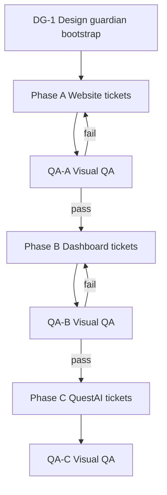

# Dispatch order

## Gates

| Gate | Pass condition |
|------|----------------|
| After Phase A | Home + hub EN/AR match contract; no Coming Soon bar; no primary `#` CTAs; suite fonts loaded |
| After Phase B | Login + home use suite primary/fonts; Hub URL not `:3700`; EN/AR on login |
| After Phase C | QI login ≈ home chrome; tokens shared file; generate not one-screen wall |

## Parallelism rules

- **Never** merge Phase B/C UI before Phase A exit.
- Within a phase, tickets marked `parallel: ok` may run concurrently if they touch disjoint files.
- Tickets marked `parallel: no` are sequential within the phase.
- Design guardian may answer token questions anytime; only DG-1 writes shared token files.

## PR rules for implementers

1. One ticket ID per PR title prefix: `[A3] Restyle website hub…`
2. PR description links contract section + audit row.
3. Do not expand scope into SSO, IAM, or other apps.
4. Prefer visual-only local verify (`npm run dev` / `serve` / `http.server`) unless ticket says otherwise.