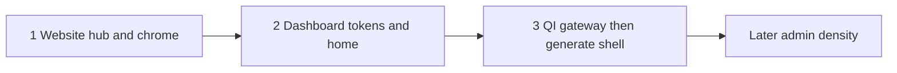

# Suite design adoption roadmap

Implements Phase 3 of the cross-suite design plan. **No product UI code changes in this document** — execution of each phase is a separate implementation approval.

**Inputs:** [`ux-suite-audit.md`](ux-suite-audit.md), [`design-system/SUITE_DESIGN_CONTRACT.md`](design-system/SUITE_DESIGN_CONTRACT.md), [`design-system/tokens.css`](design-system/tokens.css), [`ux-screenshots/`](ux-screenshots/).

## Order of adoption

Visual unity before deep product UX. Locked sequence:

---

## Phase A — Website (first)

**Why first:** Suite entry point and hub; already on `#2c5282`; fixes here set the chrome language everyone else mirrors.

| Step | Work | Files (indicative) |
|------|------|--------------------|
| A1 | Load suite fonts (Space Grotesk, Plus Jakarta, IBM Plex Arabic, Cairo) | `layout.tsx`, `globals.css`, `tailwind.config.js` |
| A2 | Mirror `--suite-*` tokens into Tailwind theme / CSS vars | `globals.css`, `design-system/tokens.css` |
| A3 | Restyle hub to marketing brand (no gray WIP strip; suite cards; translated copy) | `hub/page.tsx`, locale JSON |
| A4 | Fix dead nav/footer/CTAs (real targets or remove) | `Header.tsx`, `Footer.tsx`, `CallToActionSection.tsx` |
| A5 | Align login header with marketing chrome; env-document `NEXT_PUBLIC_*` | `login/page.tsx`, `.env.example` |
| A6 | SSR `lang`/`dir` from `[lang]`; translate tagline + missing keys | root/`[lang]` layouts, `common.json` |

**Exit criteria:** `/en` and `/ar` home + hub share one brand; hub has no Coming Soon debug bar; no primary-path `#` CTAs; fonts match contract.

---

## Phase B — Dashboard (second)

**Why second:** Largest brand outlier (slate/Inter); retokening + home collapse yields high suite recognition.

| Step | Work | Files (indicative) |
|------|------|--------------------|
| B1 | Retoken `App.css` to suite primary/fonts; load Google fonts | `App.css`, `public/index.html` |
| B2 | Unify `/` and `/home` into one gateway chrome (module cards + suite header) | `LandingPage.tsx`, `HomePage.tsx`, `App.tsx` |
| B3 | Header: suite brand lockup; collapse or prioritize nav; fix footer module label | `Layout.tsx`, `Layout.css` |
| B4 | Back to Hub → website env URL (`6015`), not `:3700` | `Layout.tsx` |
| B5 | RTL logical properties pass on layout; lang switcher on login | `Layout.css`, `Login.tsx` |
| B6 | Remove or implement Contact; Settings stub messaging | routes, `Settings.tsx` |

**Exit criteria:** Login + home read as same suite as website/QI; EN/AR switch works on login and shell; hub link correct.

---

## Phase C — QuestAI gateway (third)

**Why third:** Already closest to the contract; extract tokens and polish gateways before touching generate density.

| Step | Work | Files (indicative) |
|------|------|--------------------|
| C1 | Ship `frontend/css/suite-tokens.css` from `design-system/tokens.css`; include on pages | `home.html`, `login.html`, … |
| C2 | Restyle login to match home navbar/fonts/primary | `login.html` |
| C3 | Confirm home hub cards/CTAs match suite chrome verbs | `home.html` |
| C4 | Generate shell: progressive disclosure / multi-step Define Request (not full rewrite) | `index.html` |
| C5 | Defer admin console density redesign | `admin.html` — later |

**Exit criteria:** Login and home match suite tokens without Bootstrap-default look; generate form first step is not a full-viewport wall of fields.

---

## Success criteria (suite-wide)

A user (or reviewer) can walk:

**Website home → Hub → QuestAI home → Dashboard login/home**

and observe:

1. One primary blue (`#2c5282`) and suite display/body fonts  
2. One recognizable header pattern (brand + lang + account)  
3. Working EN ↔ AR including RTL on those gateway pages  
4. No debug Coming Soon chrome; no obvious dead primary CTAs  

Interactive SSO/API and full DB stacks remain out of scope until a later engineering track.

---

## Suggested verification (when implementing)

1. Re-run visual-only servers; refresh [`ux-screenshots/`](ux-screenshots/) for the same filenames.  
2. Diff against audit P0 items in [`ux-suite-audit.md`](ux-suite-audit.md).  
3. Checklist against section 8 of [`SUITE_DESIGN_CONTRACT.md`](design-system/SUITE_DESIGN_CONTRACT.md).

## Explicit non-goals until later

- Full SSO E2E / FastAPI / SQLite / MySQL local stacks  
- QuestAI React migration  
- Role-based IAM implementation  
- Admin mega-console redesign  
- Exam/report deep UX  
