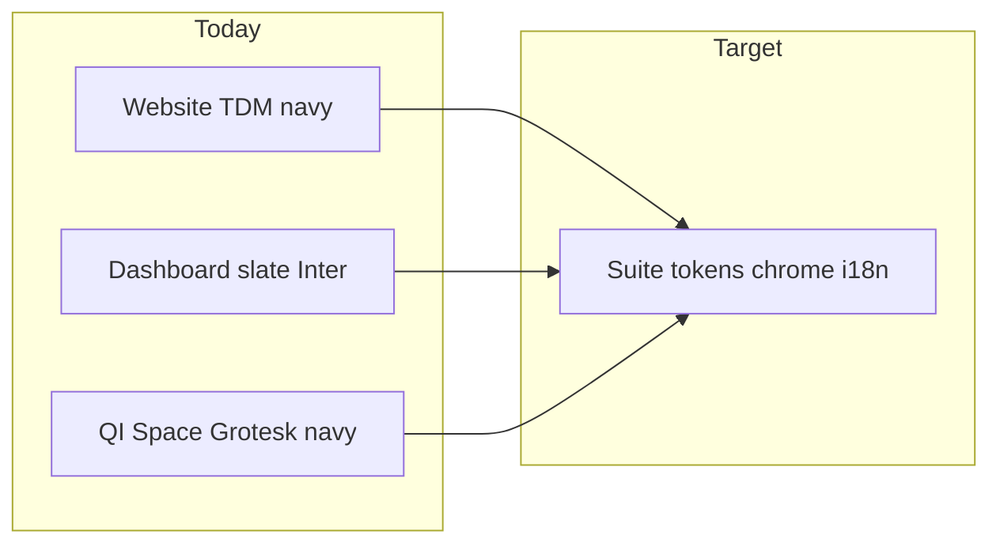

# Cross-suite UX visual audit

**Date:** 2026-07-25  
**Mode:** Visual-only (no backends / DBs / API keys)  
**Screenshot pack:** [`ux-screenshots/`](ux-screenshots/)

## Local servers used

| App | URL | How served |
|-----|-----|------------|
| Website | http://localhost:6015 | `npm install --legacy-peer-deps` + `npm run dev` |
| Dashboard | http://localhost:6019 | `npx serve -s build -l 6019` |
| QuestAI | http://localhost:6016 | `python3 -m http.server 6016` in `frontend/` |

Known limits: login/SSO/API charts fail without backends; QI `home.html` required a dummy `access_token` in `localStorage` to bypass auth redirect.

## Rubric scores (1–5)

| Criterion | Website | Dashboard | QuestAI |
|-----------|---------|-----------|---------|
| Brand first (readable without nav) | 3 | 2 | 4 |
| Token honesty (vars used vs inline hex) | 3 | 2 | 4 |
| Chrome consistency | 2 | 2 | 3 |
| Density appropriateness | 3 | 3 | 2 |
| i18n / RTL | 3 | 2 | 3 |
| Dead / WIP UI | 2 | 2 | 3 |

---

## Website (`inst-website-6015`)

**Screens:** `website-home-en-desktop.png`, `website-home-ar-desktop.png`, `website-home-*-mobile.png`, `website-hub-en-desktop.png`, `website-login-en-desktop.png`, `website-solutions-en-desktop.png`

### Findings

1. **Brand split:** Marketing uses “TDM Systems” + tagline “Knowledge is Power”; page title is “LMS Platform”. Hero is strong navy (`#2c5282`) with exam imagery — brand-first passes on home, fails on hub (gray utilitarian grid, no brand hero).
2. **Hub ≠ marketing:** Hub is a different visual language (gray canvas, icon pills, blue “Coming Soon!” strip with Gemini test ids). Looks like a separate product.
3. **i18n partial:** `/ar` RTL works for marketing copy; tagline “Knowledge is Power” stays English; hub strings are English-only.
4. **Dead chrome:** Nav anchors `#about` / `#solutions` / `#downloads` / `#contact` do not match section ids; footer links are `#`; CTA buttons on home are inert.
5. **Login chrome clash:** Login page uses a different header color path vs sticky white marketing header.
6. **Fonts:** Tailwind declares Inter; fonts are not loaded via `next/font` / Google Fonts — falls through to system UI.
7. **Mobile:** Hero and header stack acceptably; nav becomes hamburger — OK baseline.

### Priority friction

| P | Issue | Evidence |
|---|-------|----------|
| P0 | Unify hub with suite brand + translate hub | `website-hub-en-desktop.png`, `hub/page.tsx` |
| P0 | Fix or remove dead nav/footer/CTA | `Header.tsx` navItems, Footer |
| P1 | Load suite fonts; stop Inter default | `tailwind.config.js`, `globals.css` |
| P1 | Align login header with marketing chrome | `login/page.tsx` |

---

## Dashboard (`inst-dashboard-6018/frontend`)

**Screens:** `dashboard-login-desktop.png`, `dashboard-landing-desktop.png`, `dashboard-home-desktop.png`, `dashboard-home-mobile.png`

### Findings

1. **Brand divergence:** Login is bare “Executive Dashboard” with no suite primary color. Authenticated chrome uses two-line English brand “Testing and Assessment / Management Solution” — not “TDM Systems” / QuestAI vocabulary.
2. **Token ignore:** `App.css` defines `--color-primary: #1e293b` / `--color-accent: #3b82f6`, but landing/home use heavy inline hex, emoji icons, and Ant-like blues — not suite `#2c5282`.
3. **Dual home:** `/` (Landing with KPI strip + Educational/Corporate cards) vs `/home` (SSO landing with Educational / Corporate / TAMS QB) — different IA and copy for the same job.
4. **Chrome overload:** Sticky navy header packs Home, Educational admins, Executive, Corporate, Weights, Settings, Contact for every user. Footer always says “Corporate HR Intelligence Module” even on educational views.
5. **Dead routes:** Contact linked but no route; Settings is a stub.
6. **Hub escape broken:** “Back to Hub” hardcodes `http://localhost:3700` (wrong vs website `:6015`).
7. **RTL:** Lang switcher exists in header; login has none. Physical CSS (`marginLeft`, etc.) will fight RTL.
8. **Mobile:** Module cards stack; header nav does not collapse — horizontal overflow / cramped actions.
9. **Empty/error:** Without API, KPI strip shows placeholders/errors silently; no designed empty state.

### Priority friction

| P | Issue | Evidence |
|---|-------|----------|
| P0 | Retoken to suite primary `#2c5282`; drop Inter-as-brand | `App.css`, landing screenshots |
| P0 | Collapse Landing vs Home into one chrome pattern | `/` vs `/home` screenshots |
| P1 | Role-agnostic mega-nav; fix footer module label | `Layout.tsx` |
| P1 | Fix Back-to-Hub URL; remove dead Contact or implement | `Layout.tsx` |
| P2 | Mobile nav collapse; login lang switcher | mobile screenshot |

---

## QuestAI (`inst-QI-6016/frontend`)

**Screens:** `qi-login-desktop.png`, `qi-home-desktop.png`, `qi-home-mobile.png`, `qi-index-desktop.png`

### Findings

1. **Closest to suite brand:** `#2c5282`, Space Grotesk / Plus Jakarta / Cairo / IBM Plex Arabic already match the locked suite fonts. Welcome gradient hero is strong.
2. **Chrome:** Navy Bootstrap navbar with QuestAI mark + EN/AR + username — good gateway pattern to promote suite-wide.
3. **Home density OK; product density high:** `index.html` “Define Request” is a wall of selects/radios in one viewport — fights the spec’s wizard goal (50 questions / 15 min).
4. **Bootstrap vs tokens:** Custom `:root` vars overridden with many `!important` rules; Bootstrap defaults still peek through on login (plain card, default primary).
5. **Auth gate:** Static server redirects unauthenticated users to login — expected; visual review needed dummy token.
6. **i18n:** Home has lang buttons; login is thinner branded than home. Dual i18n scripts (`i18n.js` / `new-i18n.js`) risk drift.
7. **Mobile home:** Hero and cards stack cleanly; navbar brand + actions tight but usable.

### Priority friction

| P | Issue | Evidence |
|---|-------|----------|
| P0 | Extract shared `tokens.css`; include from all HTML | `home.html` `:root` block |
| P1 | Restyle login to match home chrome/fonts | `qi-login-desktop.png` vs home |
| P1 | Generate form (`index.html`) → stepped wizard shell | `qi-index-desktop.png` |
| P2 | Admin console density (later pass) | code size of `admin.html` |

---

## Cross-suite synthesis

**What already aligns:** Website marketing primary and QI `--accent-blue` are both `#2c5282`. QI typography is the best candidate to promote suite-wide.

**Biggest gaps:**
1. Dashboard color/type/chrome are a different product.
2. Website hub is an unfinished third look.
3. No shared header pattern (brand + product + lang + account).
4. EN/AR incomplete on hub and dashboard login; RTL unfinished on dashboard.
5. Dead links and WIP chrome undermine trust before visual polish matters.

**Separate engineering tracks (not design-system):** SSO/API contracts, QuestAI React rewrite, role-based IAM, interactive stacks.

---

## Screenshot index

| File | What |
|------|------|
| `website-home-en-desktop.png` | Marketing hero EN |
| `website-home-ar-desktop.png` | Marketing hero AR/RTL |
| `website-home-en-mobile.png` | Marketing mobile EN |
| `website-home-ar-mobile.png` | Marketing mobile AR |
| `website-hub-en-desktop.png` | App launcher + Coming Soon |
| `website-login-en-desktop.png` | Suite login |
| `website-solutions-en-desktop.png` | Solutions catalog |
| `dashboard-login-desktop.png` | Bare login |
| `dashboard-landing-desktop.png` | `/` module picker + KPIs |
| `dashboard-home-desktop.png` | `/home` SSO landing |
| `dashboard-home-mobile.png` | Home mobile |
| `qi-login-desktop.png` | QuestAI login |
| `qi-home-desktop.png` | QuestAI home (brand reference) |
| `qi-home-mobile.png` | QuestAI home mobile |
| `qi-index-desktop.png` | Dense generate form |
